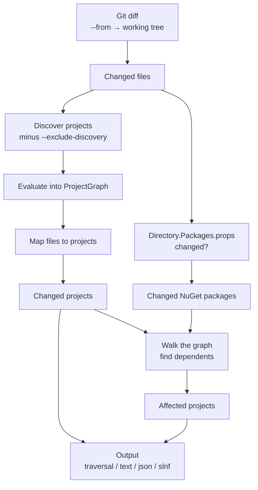
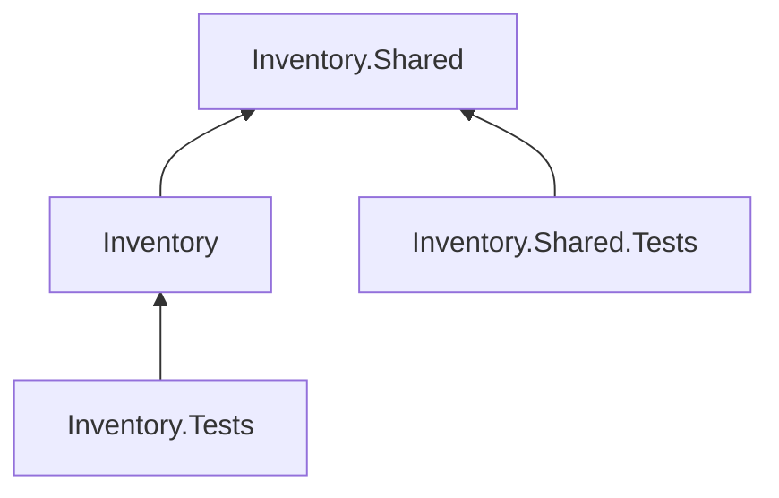
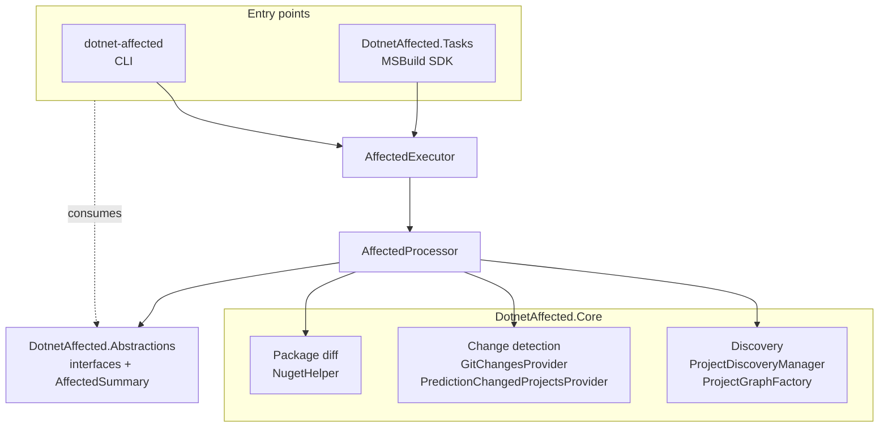
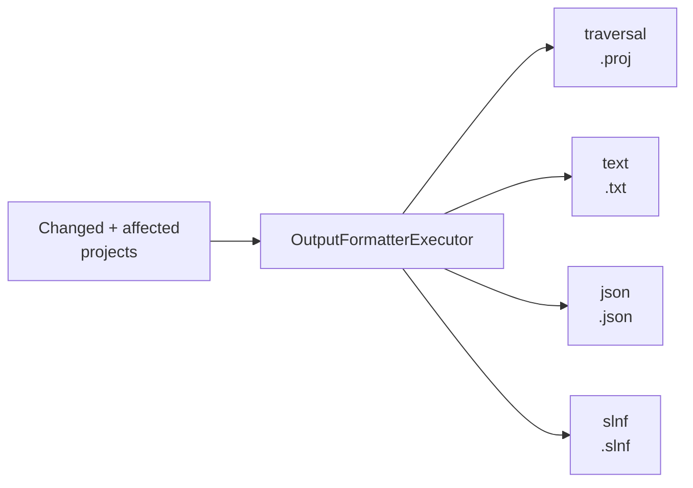

## The pipeline

1. **Diff.** The working tree is compared with Git against the `--from` baseline, producing the list of changed files.
   `--uncommitted` decides whether staged changes, unstaged changes and untracked files count on top of the commits.
   With nothing specified, that is `HEAD` against a working tree where everything counts.
2. **Discover and evaluate projects.** All `.csproj`, `.fsproj` and `.vbproj` under the repository path are found — or
   just the ones a [filter file](/guides/project-discovery/) lists — then `--exclude-discovery` removes any that
   should never be loaded, and MSBuild evaluates the rest into a `ProjectGraph` that records which project depends on
   which.
3. **Map files to projects.** Every changed file is attributed to the projects that reference it. This is broader than
   "files in the project folder": it covers any item MSBuild pulls in, and imported files like `Directory.Build.props`,
   which belong to every project importing them.
4. **Diff NuGet packages.** If `Directory.Packages.props` changed, the package sets are compared across the same two
   revisions the file diff used — see [NuGet package changes](/guides/nuget-packages/).
5. **Walk the graph.** From the changed projects and changed packages, dependents are followed transitively.
6. **Format the output.** The changed and affected projects are written in the requested
   [formats](/guides/output-formats/).

:::note[Project files nothing owns]
A changed `.csproj` that is not in the graph is reported as a warning naming why it is missing — `--exclude-discovery`
matched it, the filter file does not reference it, or git ignores the path it is under. It still counts among the
changed files while nothing is reported as changed or affected by it, which otherwise looks exactly like a correct
empty result. Deleted project files are not reported: a graph without them is the right answer.
:::

:::note[Why the diff comes first]
The graph is built *after* the diff, not before. A deleted file matches no glob and satisfies no `Exists()` condition,
so a project that referenced it would evaluate as if the file had never been there and never show up as changed.
Knowing the diff first lets the deleted files be read back from the `from` commit and overlaid onto the file system
that MSBuild evaluates against. When nothing was deleted — the common case — projects are evaluated against the real
file system and no overlay is created.
:::

## Changed vs. affected

A project is **changed** when one of its own files changed. A project is **affected** when it depends, directly or
transitively, on something that changed — another project, or a NuGet package whose version moved.

When **`Inventory` changes**, `Inventory.Tests` is affected, so both are built and tested. `Inventory.Shared.Tests` is
left alone, because `Inventory.Shared` did not change.

When **`Inventory.Shared` changes**, everything is built and tested — transitively, they all depend on it.

:::tip
Both lists matter for a build: the changed projects need building because they changed, and the affected projects need
building because their dependencies changed. Every output format includes both.
:::

## Architecture

Three packages, plus the MSBuild SDK, layered so that the analysis has no idea how it is being driven.

### `DotnetAffected.Abstractions`

The contracts, and nothing else: `IAffectedExecutor`, `IChangesProvider`, `IChangedProjectsProvider`,
`IProjectDiscoverer`, `IDiscoveryOptions`, plus the result types `AffectedSummary` and `PackageChange`. Both entry
points and the whole of Core depend on this and not on each other.

### `DotnetAffected.Core`

Where the work happens.

| Piece                               | Responsibility                                                                                       |
|-------------------------------------|-------------------------------------------------------------------------------------------------------|
| `AffectedExecutor`                  | The public entry point. Takes options and optional providers, returns an `AffectedSummary`             |
| `AffectedProcessor`                 | The pipeline above, step by step, over a context that carries state between steps                      |
| `ProjectDiscoveryManager`           | Picks a discoverer from the filter file's extension — directory, `.sln`/`.slnx`, `.slnf` or `.proj` — and applies `--exclude-discovery` |
| `ProjectGraphFactory`               | Evaluates the discovered projects into an MSBuild `ProjectGraph`, optionally through an overlay        |
| `GitChangesProvider`                | Diffs with LibGit2Sharp, and reads file contents and project files at a given commit                   |
| `PredictionChangedProjectsProvider` | Maps changed files to projects using `Microsoft.Build.Prediction`'s input predictors                    |
| `NugetHelper`                       | Parses and diffs `PackageVersion`/`PackageReference` items from both sides of the range                 |
| `SolutionFilter`                    | Reads and writes `.slnf` documents, used both as discovery input and as output format                   |
| `TraversalProject`                  | Authors the Traversal project XML directly, without evaluating it                                       |

The graph itself is built lazily by the processor's context, which is what allows the diff to run first. Discovery
runs there too, rather than inside the factory, because it is the only step that knows what was excluded — and an
excluded project cannot be reported through the graph it was deliberately kept out of.

### `dotnet-affected` (CLI)

A [System.CommandLine](https://learn.microsoft.com/dotnet/standard/commandline/) front end. It parses options into
`AffectedOptions`, calls the executor, renders the tables you see with `--verbose` or `describe`, and hands the result
to the output formatters. It adds no analysis of its own — with one exception: exit code
[`166`](/reference/exit-codes/) is raised here, not in Core.

### `DotnetAffected.Tasks` (MSBuild SDK)

An MSBuild task wrapping the same executor. Instead of writing files, it replaces the `ProjectReference` items of the
project being built, so Traversal builds exactly the affected set. See the [MSBuild SDK](/msbuild-sdk/) section.

## Output formatting

Formatters are a small strategy interface — a `Type` name, a file extension, and a method turning the project list
into text:

The executor deduplicates projects by path, resolves each requested `--format` value to a formatter, and writes
`<output-name><extension>` into the output directory — or prints it, under `--dry-run`. Formats are independent, so
asking for several costs one extra file each and no extra analysis.

Each formatter also receives an `OutputFormatterContext` carrying the path of the file being written and the filter
file projects were discovered from. That is what lets `slnf` emit paths relative to the right directories and name the
solution it filters; formats that only list projects ignore it.

## Extension points

Because Core takes its collaborators as interfaces, the analysis can be driven from something other than Git or the
file system. `AffectedExecutor` accepts an `IChangesProvider` — the source of changed files and of file contents at a
commit — and an `IChangedProjectsProvider`, which decides how changed files map onto projects. The built-in
implementations are `GitChangesProvider` and `PredictionChangedProjectsProvider`; the test suite substitutes its own,
and `--assume-changes` works by skipping the change discovery step entirely.

## Comparing something other than `HEAD`

The comparison always ends at your working tree, since that is where projects are discovered and evaluated.
[`--from`](/guides/commit-ranges/) chooses the baseline, and `--uncommitted` chooses how much of the working tree
counts on top of the commits since then.
